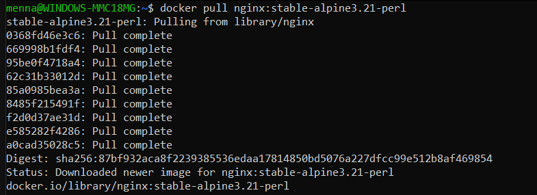
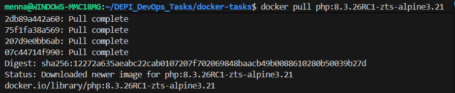
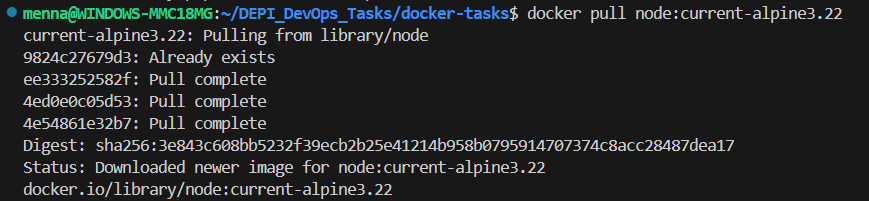
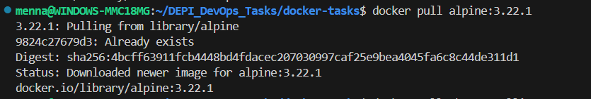
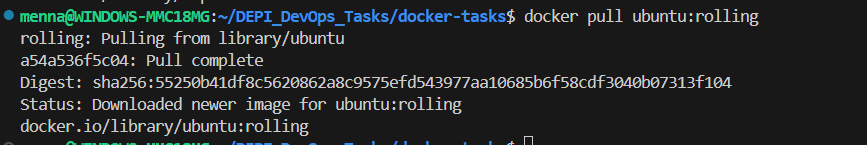
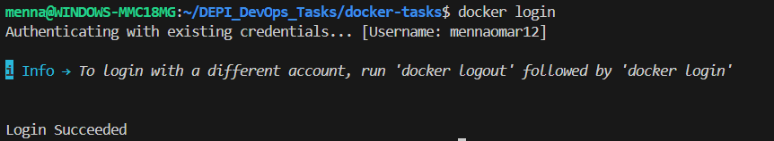
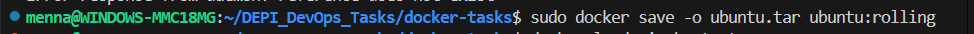
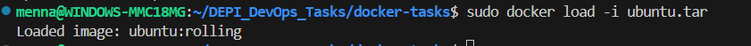

# 1. Pulling some images

## 1.Nginx Image

## 2.Php Image

## 3.Node Image

## 4.Alpine Image

## 5.Ubuntu Image

# 2. Docker login

# 3. Save and Load image

# 4. Edit inside nginx container

# 5. Build spring pet clinics

## 1. locally

  

## 2. using docker

1. Create docker file and then build
