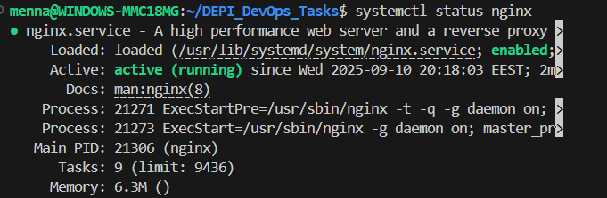
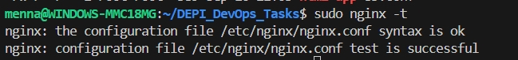
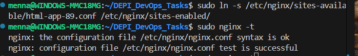

# 1. Install nginx on Ubunto
```bash
sudo apt update
sudo apt install nginx -y 
```
# 2. Check status:
```bash
systemctl status nginx
```


# 3. Place my HTML project:
```bash
sudo mkdir -p /var/www/html-app
sudo nano /var/www/html-app/index.html
```

# 4.Create a New Config File
```bash
sudo nano /etc/nginx/sites-available/html-app-85.conf
sudo nano /etc/nginx/sites-available/html-app-89.conf
```
# 5.Change the Port
```nginx
server {
    listen 8089;   # change port here
    server_name localhost;

    root /var/www/html-app;
    index index.html;

    location / {
        try_files $uri $uri/ =404;
    }

    # Serve images with caching
    location /image/ {
        root /var/www/html-app;   
        expires 30d;               # cache images for 30 days
        add_header Cache-Control "public";
    }
}

```
# 6. Enable Config
## port 85
```bash
sudo ln -s /etc/nginx/sites-available/html-app-85.conf /etc/nginx/sites-enabled/
sudo nginx -t
```

```bash
sudo systemctl reload nginx
```
## port 89
```bash
sudo ln -s /etc/nginx/sites-available/html-app-89.conf /etc/nginx/sites-enabled/
sudo nginx -t
```

```bash
sudo systemctl reload nginx
```
# 7. Test in Browser
http://localhost:8085
http://localhost:8089